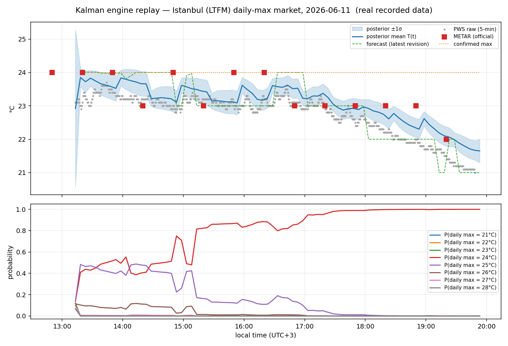

# Weather Prediction Markets

**From a newly published weather observation to a prepared market action.**

I built weather-market data collection and execution components and researched how station observations
and forecasts change daily maximum-temperature probabilities. The work connects source timing,
probability modeling, market rules and the cost of acting through an order book.

The public engineering layer shows NOAA/MGM parsing and concurrent collection, observation clocks,
CLOB metadata caching and pre-signing, and connection/request instrumentation. A recorded Kalman replay
shows the probability-model side. Start with the [system architecture](docs/system-architecture.md),
or use the [contribution index](CONTRIBUTIONS.md) for a quick technical review.

## What I built

| Problem | Approach | Inspect |
|---|---|---|
| New observations arrive through different sources and may repeat | Persistent HTTP clients, source-specific concurrent polling, parsing and observation identity | [Acquisition and event flow](docs/acquisition-implementation.md) |
| Setup work delays an event-triggered order | Fetch metadata/balance and build/sign before the trigger; reuse cached inputs | [Preparation and submission](docs/execution-engineering.md) |
| A single latency number hides the bottleneck | Separate DNS, TCP, TLS, warm requests and signed submission; compare historical locations | [Measurement case and probe](benchmarks/README.md) |
| Continuous temperature observations must become discrete outcome probabilities | Temperature posterior, source uncertainty and remaining-day Monte Carlo | [Probability model](docs/model.md) |

## Run the engineering examples

Python 3.10 or newer; standard library only:

```bash
python -B examples/acquisition_walkthrough.py
python -B examples/execution_walkthrough.py
python -B -m unittest discover -s tests -v
```

The first example follows a synthetic report through source arrival, duplicate delivery and correction.
The second traces cache warmup, signing and submission through local providers and a fake transport.
Their purpose is to make the implementation inspectable; historical latency evidence is listed separately.

## Run the recorded probability example

```bash
python -m pip install -r requirements.txt
python -B replay.py --out output/replay.png
```

The Istanbul example covers 11 June 2026 and processes 1,165 recorded input events: 1,097 PWS
readings, 26 METAR observations and 42 forecast records. The driver orders records by their arrival
timestamps and updates the temperature posterior and daily-maximum distribution.



This one-day example demonstrates the implementation. It is not an out-of-sample forecasting score
or a trading return. The confirmed maximum in the replay is an observation-derived quantity;
contractual settlement must be checked against the individual market rule.

## Research components

- [System architecture](docs/system-architecture.md): source collectors, relay, market state and execution.
- [Execution engineering](docs/execution-engineering.md): historical v1/v2 clients and preparation costs.
- [Model](docs/model.md): posterior, forecast pull and outcome distributions.
- [Observations](docs/observations.md): arrival clocks and component boundaries.
- [Calibration](docs/calibration.md): feature studies and same-data parameter fitting.
- [Market events](docs/market-events.md): bucket repricing and evidence limits.
- [Limitations](docs/limitations.md): consistency metrics, deployment and generalization.

| File | Purpose |
|---|---|
| `weather_research/` | Portable acquisition and execution components |
| `examples/` | Offline engineering walkthroughs and synthetic source payloads |
| `benchmarks/` | Historical measurement record and read-only connection probe |
| `kalman_engine.py` | Offline model implementation |
| `replay.py` | Arrival-ordered replay and figure generation |
| `data/` | Recorded example and provenance manifest |
| `docs/` | Methods and research scope |
| `REPRODUCIBILITY.md` | Commands and what they establish |
| `CONTRIBUTIONS.md` | Contribution-to-code/evidence index for technical and application review |

The collection/execution system and inference research were parts of the same programme, but their
versions and deployment states differed. In particular, the final calibration report described
an offline configuration that had not been deployed.

The engineering extracts preserve the historical design and document their portability and correctness
changes in [provenance](docs/engineering-provenance.md). Wider sensor, calibration and strategy studies
are summarized in the method pages; their full pipelines are not reproduced by these examples.

[Eren Ege Çelik](https://www.erenege.dev) ·
[Related crypto research](https://github.com/ErenEgeCelik/btc-5m-market-microstructure)

## License

Authored code and documentation: [MIT](LICENSE). Third-party data provenance is described in [data/README.md](data/README.md).
