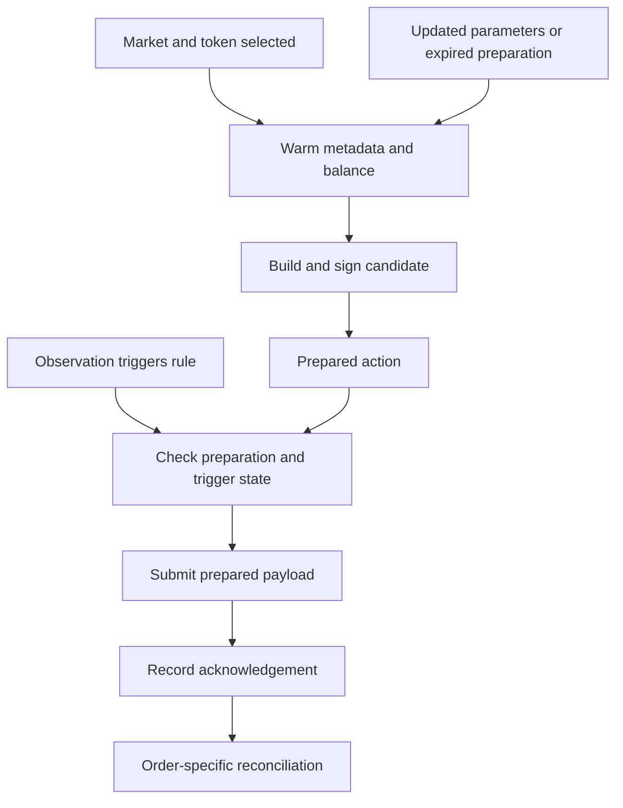

# Preparing orders before the observation arrives

A weather observation is an event, while most order-building inputs change on a slower schedule.
The execution design exploits that separation. Market discovery, token metadata, balance checks and
signing can usually happen while waiting for the next observation. The event path selects a prepared
action and submits it.

## Two paths



For an unprepared path, local work and remote calls may include

`metadata fetch + balance fetch + build + sign + POST/response`.

For a valid prepared action, the submission routine primarily needs

`validity check + POST/response`.

Independent preparation calls can overlap. Parallelism does not remove their cost; it moves that cost
out of the trigger path and reduces preparation's critical dependency chain.

## What changed between the historical clients

| Concern | Earlier client | Later client |
|---|---|---|
| Metadata warmup | Tick size, market type and fees fetched before order creation | Explicit metadata caches plus version/balance handling |
| Preparation scheduling | Sequential warmup path | Async warmup of independent SDK requests |
| Signing | Pre-signed market-order path available | Preparation reused through a common client interface |
| Connection lifetime | Reuse depended on client state | Periodic lightweight request kept the SDK connection warm |
| Integration | Client-specific submission helpers | Shared interface with compatibility wrappers and response adaptation |

This comparison concerns the inspected historical wrappers. It is not a comparison of today's SDKs
and does not establish that one protocol version is inherently faster. The measurement report separates
client design from controlled latency evidence.

## Cache lifetime is part of the design

Metadata and balance should not be treated as equally persistent. Tick size and market settings may
survive repeated preparation; fees, balances and prepared quantities can require refresh. A prepared
payload is useful only while its assumptions remain valid.

The historical code included repeated warmup, balance refresh and pre-sign renewal near observation
windows. The public interface exposes the relevant cache and preparation boundaries and documents its
additional validity guards. Inspect the [implementation notes](execution-implementation.md) for the exact
mapping, rather than assuming the public interface is a drop-in live client.

## Inspect the work removed from submission

```bash
python -B examples/execution_walkthrough.py
```

The example uses local providers and a fake transport. Its call trace shows fetching, preparation,
cache reuse and submission. It checks that a prepared submission does not perform metadata fetching
or signing. No invented milliseconds are assigned to those calls.

The tests cover preparation failure and lifecycle cases as well as the successful path:

```bash
python -B -m unittest discover -s tests -p "test_execution.py" -v
```

## Response time is not fill time

Historical wrappers contained inconsistent treatment of delayed responses. The public extraction keeps
pending submission distinct from order-specific confirmation. This is a documented publication correction,
not evidence that the old deployed system already handled every response consistently.

Likewise, a historical metric named `total_e2e` started inside the trigger function and ended at its HTTP
response. It excluded source publication, observation discovery and subsequent fill notification. The
[latency record](../benchmarks/README.md) names the actual timing intervals.

## Source and evidence

- [Execution implementation](../weather_research/execution.py)
- [Source mapping and adaptation notes](execution-implementation.md)
- [Historical extraction provenance](engineering-provenance.md)
- [Contribution index](../CONTRIBUTIONS.md)
