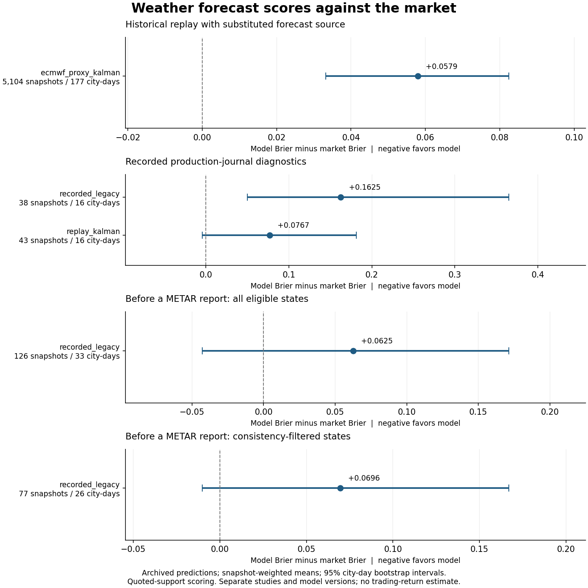

# Experiments: model information versus market information

The empirical sequence moved from sensor selection and parameter fitting to
market-relative scoring. In the larger archived replay, model/market disagreement
correlated with later market marks, but the model had a worse final-outcome Brier
score than the market on eligible quoted support. Those are different tests,
and neither measures executable PnL.

Reproduce the figure with `python examples/plot_research_scores.py`, or inspect
the numbers with `python examples/research_audit.py --json`. The audit recomputes
score means, city-day bootstrap intervals and denominators from compact released
inputs. It does not regenerate forecasts from the full acquisition archive.

## Measurement contract

For bucket k at snapshot t, let p be model probability, m the market mark, and y
the final resolved indicator. The multiclass Brier score and paired difference are

$$
BS_t=\sum_k(p_{t,k}-y_k)^2,\qquad
\Delta_t=BS_t^{model}-BS_t^{market}.
$$

This is a sum over categories, not a per-bucket average or a percentage. Its
range is 0–2 for a normalized categorical distribution. Positive delta means the
model scores worse. A snapshot is eligible only when quoted buckets contain at
least .80 model probability mass, positive market mass, and exactly one resolved
YES bucket. Both vectors are renormalized over those buckets. The comparison is
conditional on available quoted support; it does not penalize missing buckets.

Means weight each eligible snapshot equally. The bootstrap samples **city-days
with replacement**, retaining all their snapshots, and recomputes that mean:
1,000 repetitions, 2.5/97.5 percentiles, deterministic model-specific seeds. It
is not an equally weighted mean of city-day means. Cross-city dependence and
weather regimes spanning adjacent days are not separately blocked.

## 1. ECMWF source-substituted replay

The May 12–August 11, 2026 archive requests 184 Wellington/Istanbul city-days,
matches 178, and contains 52,918 bucket/snapshot rows. The stored inventory counts
344 forecast-run files. Outcome scoring retains **5,104 snapshots in 177
city-days**. These are distinct denominators.

The replay joins archived ECMWF IFS runs to METAR, PWS and Polymarket price marks:

- Latest available forecast run, with assumed availability at initialization
  plus six hours.
- METAR availability at valid time plus five minutes and PWS availability at
  observation time plus one minute. These are assumptions rather than historical
  receive timestamps.
- A causal PWS health gate: at least 50 readings, five distinct temperatures and
  a .5-unit range observed so far. Rejected early readings are not replayed later.
- Snapshots every 30 minutes from local 06:00 through 20:00; 2,000 simulation
  paths per snapshot. Market marks are matched backward only, no older than ten
  minutes. Outcomes use resolved Polymarket YES tokens.

Parameters come from the calibration artifact. The replay window overlaps dates
used in earlier fitting, and a pre-window frozen selection record is not
established. This is a source-substituted historical replay, not production
Wunderground replay or a fully chronological holdout.

| Comparison | Model Brier | Market Brier | Model minus market | 95% city-day interval |
|---|---:|---:|---:|---|
| 5,104 eligible snapshots | 0.334348 | 0.276414 | +0.057934 | [+0.033162, +0.082452] |

The public audit reproduces that mean and interval from **177 city-day count/sum
records**, derived from all archived bucket rows. It also re-scores one complete
day from its probabilities. Compact totals reproduce this full-sample statistic;
they cannot regenerate original model probabilities or snapshot medians.

A separate historical regression used `edge = model_p - market_p` to explain
subsequent market moves. Recorded slopes are .0474 at 30 minutes, .0667 at 60
minutes and .0881 at 120 minutes, with 50,863, 48,965 and 45,238 bucket-pair rows.
Positive response association coexists with the worse outcome score. Forward
matching selects the nearest snapshot to the horizon within a tolerance (22.5
minutes at the stored sampling setting); effective and nominal horizons can
differ. These regressions remain **archived reports**, not compact-audit reruns.

Price marks have no executable spread, queue, fill probability, fees or
adverse-selection model. Placebo and tape-level stability results are not
established for these weather slopes, so they are research observations rather
than an edge claim.

## 2. Production-journal comparison

The journal exercise preserves recorded model identity and compares it with a
Kalman reconstruction using recorded inputs. It discovers 30 city-days, matches
18, and produces 432 base bucket rows. Filters use five-minute state sampling,
two-sided quotes within five seconds, and spread at most .20. Market probabilities
come from those quotes, unlike the larger replay's price-history marks.

| Model identity | Scoreable snapshots | City-days | Model Brier | Market Brier | Delta, 95% interval |
|---|---:|---:|---:|---:|---|
| Recorded legacy | 38 | 16 | 0.388322 | 0.225798 | +0.162524 [+0.050057, +0.365048] |
| Replayed Kalman | 43 | 16 | 0.276296 | 0.199580 | +0.076715 [-0.004258, +0.181487] |

Both rows and intervals are independently re-scored by the public audit. Different
snapshot counts and market scores show that eligibility differs by model.
Subtracting the two model means is not a matched-snapshot causal engine comparison.
A reconstructed value also does not establish that Kalman produced it live.
The journal's forward-price tests have only three or four city-day clusters at
their horizons; they remain small-sample diagnostics.

## 3. Pre-METAR event diagnostics

This audit asks whether Q_next predicts the next reported temperature and whether
P_now outperforms market probabilities before the event. Q_next is not itself a
traded Polymarket distribution, so its benchmark is deterministic **last-METAR
persistence**, not market-implied probabilities.

Selection imposes a 30-second embargo before METAR valid time, state age at most
600 seconds, book age at most 120 seconds, predicted event-time error at most
three minutes, and spread at most .15. Fahrenheit city-days are excluded because
their historical unit chain was not verified. Valid-time embargo does not prove
exact public dissemination time.

The Q sample contains 167 events, 38 city-days and 11 cities. **166 events in 37
city-days are recorded legacy**, and only one is recorded Kalman. Legacy mean Q
Brier is .536346 versus .759036 for persistence (63 changed, 103 unchanged
temperatures). An uncertain forecast can improve on a deterministic "no change"
baseline. This does not show Kalman beating market prices.

The public command recomputes Q means/counts from archived event-score rows.
The full Q distributions are absent, so it does not reconstruct those event
scores. The source's paired-difference interval [-.379503, -.069745] remains an
archived bootstrap report, not a newly computed interval in this command.

The direct P_now comparison contains 604 bucket rows across 156 events in 36
city-days. Quoted-support eligibility leaves 126 snapshots in 33 city-days. A
separate sensitivity filters the stored consistency residual at .10:

| Legacy fair-value sample | Events before score eligibility | Scoreable snapshots | City-days scored | Delta Brier, 95% interval |
|---|---:|---:|---:|---|
| All event states | 156 | 126 | 33 | +0.062478 [-0.042799, +0.171363] |
| Residual <= .10 | 89 | 77 | 26 | +0.069587 [-0.010176, +0.166989] |

The filtered mean remains positive and its interval spans zero. Filtering does
not turn it into evidence of model outperformance. The .10 threshold applies to
stored legacy residuals and is not interchangeable with the new public model's
maximum-per-bucket consistency tolerance. Both tables are re-scored from the same
released bucket rows, keeping filtered and unfiltered denominators distinct.
The archived post-METAR response slopes at five, ten and fifteen minutes all have
city-day intervals spanning zero; they are not rerun here.

## What can be carried forward

The contribution is the sequence of distinct tests: sensor-specific information,
fitted parameter improvement, source availability and alignment, proper outcome
scoring, matched support, repeated-observation uncertainty, and event-specific
baselines. Outcome scoring provides a concrete counterweight to a promising
response correlation. A future evaluation would freeze sources and model selection
before later dates, add placebo and day-block stability checks, and evaluate
executable decisions separately. Those steps are not claimed as completed here.
