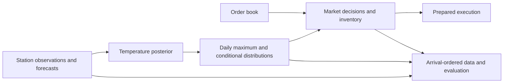

# Weather research map

The research question is how newly available weather information should change contract probabilities
and trading decisions. Acquisition and execution are the engineering layers around that question.
This repository groups the programme in one place.

## Research layers

| Layer | Question | Public material currently available |
|---|---|---|
| Observations | What was measured, and when could the system know it? | [Clocks](observations.md), [parser/scheduling implementation](acquisition-implementation.md), synthetic examples |
| Probability models | How does an observation change temperature and maximum-temperature probabilities? | [Model overview](model.md), [model code](../kalman_engine.py), [recorded replay](../replay.py) |
| Sensor information and calibration | Which inputs and parameters improve a specified predictive task? | [Study summaries and evaluation scope](calibration.md); original wider pipelines are not yet included |
| Strategies and decisions | What happens when a bucket becomes impossible, or a future observation changes fair value? | [Bucket-repricing study summary](market-events.md); fuller EV/decision implementations are not yet included |
| Execution engineering | Which work can be completed before the observation-triggered action? | [System architecture](system-architecture.md), [cache/pre-sign design](execution-engineering.md), offline code and [timing case](../benchmarks/README.md) |

The engineering chapter has the deepest public documentation in this revision. It is one layer of
the research, rather than a replacement for the model and strategy work. A module's presence in the
historical programme does not mean every version was wired into autonomous execution.

## Choose a starting point

- **Quantitative research:** run the recorded replay, inspect the probability model, then read the
  calibration and event-study scope.
- **Trading:** follow the information/decision chain and the bucket-repricing question, then examine
  preparation and submission assumptions.
- **Research engineering:** read the system architecture and run the acquisition and execution examples.

[CONTRIBUTIONS.md](../CONTRIBUTIONS.md) links specific work to code and evidence.
[REPRODUCIBILITY.md](../REPRODUCIBILITY.md) identifies which results each command can regenerate.
