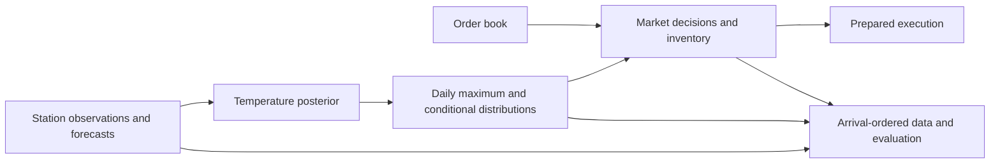

# Weather research map

The research question is how newly available weather information should change contract probabilities
and trading decisions. Acquisition and execution are the engineering layers around that question.
This repository groups the programme in one place.

## Research layers

| Layer | Question | Public material currently available |
|---|---|---|
| Observations | What was measured, and when could the system know it? | [Clocks](observations.md), [parser/scheduling implementation](acquisition-implementation.md), synthetic examples |
| Probability models | How does an observation change temperature and maximum-temperature probabilities? | [Model and versions](model.md), [derivation and source map](model-derivation.md), [model code](../kalman_engine.py), [recorded replay](../replay.py) |
| Sensor information and calibration | Which inputs and parameters improve a specified predictive task? | [Feature design and calibration](calibration.md), [experiment records](experiments.md), [runnable score audit](../examples/research_audit.py) |
| Strategies and decisions | What happens when a bucket becomes impossible, or a future observation changes fair value? | [Strategies and payoff equations](strategies.md), [decision implementation](decision-implementation.md), [model-to-decision example](../examples/decision_walkthrough.py) |
| Execution engineering | Which work can be completed before the observation-triggered action? | [System architecture](system-architecture.md), [cache/pre-sign design](execution-engineering.md), offline code and [timing case](../benchmarks/README.md) |

The model, empirical and decision chapters complement the acquisition and execution components.
The public package retains distinctions between deployed collectors, offline inference/calibration,
and decision research. A module's presence does not mean every version drove autonomous execution.

## Choose a starting point

- **Quantitative research:** inspect the filter and conditional-distribution equations, run the recorded
  replay, then audit the paired research scores and read the feature-study design.
- **Trading:** follow the model-to-decision example into scenario payoffs, risk penalties and conditional
  actions; compare deterministic bucket rules, then inspect preparation and submission.
- **Research engineering:** read the system architecture and run the acquisition and execution examples.

[CONTRIBUTIONS.md](../CONTRIBUTIONS.md) links specific work to code and evidence.
[REPRODUCIBILITY.md](../REPRODUCIBILITY.md) identifies which results each command can regenerate.
