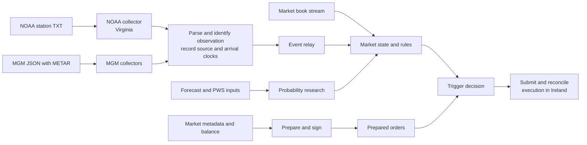

# From a weather observation to a market action

The engineering problem was to act on a newly available observation without spending the observation's
useful lifetime discovering markets, fetching order metadata or setting up fresh connections. I separated
continuous acquisition, market-state maintenance, order preparation and event-triggered submission.

The research system had two complementary paths. Deterministic rules identified outcomes that a reported
temperature had made impossible. Probability research estimated how plausible the remaining outcomes were.
Both needed a consistent observation identity and a current view of the book.

This is a component map of the historical programme. Probability engines and autonomous execution
evolved in different versions; the diagram does not imply that every research model drove live orders.

## 1. Put collection near the source and execution near the venue

NOAA acquisition was assigned to a Virginia collector and order submission to an Ireland execution
process. MGM used separate collectors. This split allowed source-specific polling and parsing to evolve
without putting that work inside the order-submission routine.

Geographic placement matters through the paths actually traversed: source to collector, collector to
executor and executor to venue. A fast fetch alone does not measure the full path. Historical machine
labels do not establish physical hosting location; see the [measurement record](../benchmarks/README.md).

## 2. Reuse connections and schedule by source

The inspected collectors used persistent `httpx.AsyncClient` pools with HTTP/1.1 and a 60-second
keep-alive expiry. Pool size and worker count were explicit settings. The intent was to amortize
connection setup over repeated requests while supporting concurrent polls.

The scheduling policies differed:

| Collector | Historical scheduling | Consequence |
|---|---|---|
| NOAA | Concurrent polls collected through `asyncio.gather`, followed by batch processing/broadcast | Delivery can wait for the batch; first response and first broadcast are different events |
| MGM | Independently running station workers, each publishing after its poll completes | A completed worker need not wait for every other worker |

The [acquisition code](../weather_research/acquisition.py) makes the source formats and scheduling
distinction inspectable with an injected fetcher. The offline example models completion ordering; it is
not a measurement of those remote services. These were HTTP connection-pool optimizations, not a custom
TCP protocol implementation.

## 3. Separate an observation from its delivery

A station observation can reach the system through more than one source. A new HTTP response is not
necessarily a new observation. MGM also exposes a live decimal temperature distinct from the METAR
temperature used by the historical rules.

The normalized event retains the source, station, raw METAR, observation time and local arrival time.
This supports deduplication, correction handling and arrival-ordered replay. It also lets the reader see
when a temperature was observed versus when it became available to this process.

See [clocks and observations](observations.md) and the [parser extraction notes](acquisition-implementation.md).

## 4. Prepare before the trigger

The preparation path fetched token tick size, market type, fees, version and balance, then built and
signed an order. Later versions parallelized independent warmup calls and kept the SDK connection warm
between infrequent weather events. Trigger handling consumed the prepared order.

The interesting optimization is the removal of work from the event-sensitive path. It is inspectable
through which calls happen before and after the trigger, even without assigning a latency number to them.
See [execution engineering](execution-engineering.md) and its runnable call trace.

## 5. Keep submission and outcome accounting separate

An acknowledgement, a pending request and a confirmed fill represent different states. An execution
system must reconcile what happened to a particular order before treating it as a position. Prepared
orders also need a lifetime: changed market parameters, renewed balance information or a consumed trigger
can invalidate preparation.

The public extraction makes these boundaries explicit and records changes from historical implementations
in the [provenance notes](engineering-provenance.md).

## Read or run

- Start with `python -B examples/acquisition_walkthrough.py` to follow raw source events into normalized observations.
- Run `python -B examples/execution_walkthrough.py` to inspect preparation and submission calls.
- Run `python -B replay.py --out output/replay.png` for the recorded probability-model example.
- Use [CONTRIBUTIONS.md](../CONTRIBUTIONS.md) to navigate from a contribution to code and evidence.
